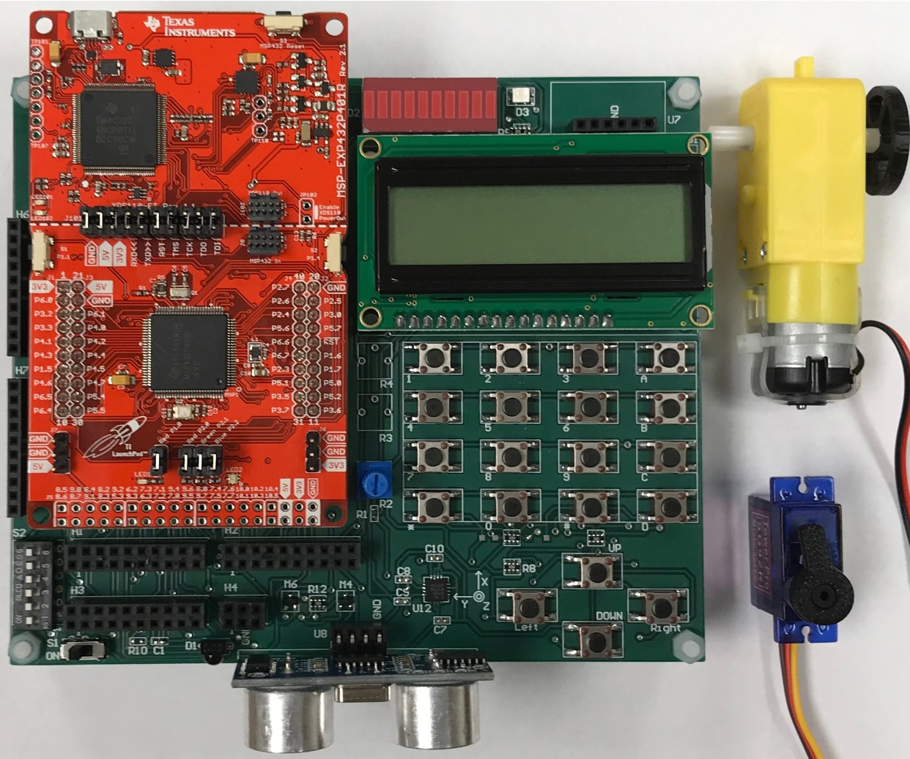

# TI-BH-EDU-board-kit V1.7 reference

DOI: 10.5281/zenodo.2538993

This is a lab kit that will be used throughout Dr. Hur's ESET 369 course in Texas A&M University. It includes several input and output components which are covered in an embedded system course  

*(Note) This kit does not include TI Launchpad boards as is in the picture. A TI Launchpad was shown just for reference to show how it can be mounted.*
 
 
This kit includes:

- TI BH EDU board V1.7 (assembled) 

- 16 key keypad 

- 16 x 2 LCD module 

- Accelerometer board 

- DC/Stepper Motor Driver Board  

- Plastic container 

This is __NOT a required__ kit purchase who takes the course. Students can access this kit during the lab hours.  
As a service to the students who take the course and for their learning purpose, the kit is available for purchase.  

*Texas A&M Marketplace item link:   https://secure.touchnet.com/C21490_ustores/web/classic/product_detail.jsp?PRODUCTID=11169* 

This kit was was designed to be used in Dr. Hur’s ESET 369 course. It is not expected nor possible to handle a large quantity of the order. Please, understand the minimum lead time of __two weeks__.  
Throughout the ESET 369 course, the detail of this kit will be covered in depth.  

 

(Disclaimer) This kit is for Dr. Hur’s ESET 369 course. This kit includes an non-functional and experimental board. Throughout the course, students will learn how to use them to make them function properly. Dr. Byul Hur nor Texas A&M will not be responsible for *any of the issues regarding the items such as damaged products or any types of injuries or accidents*.
